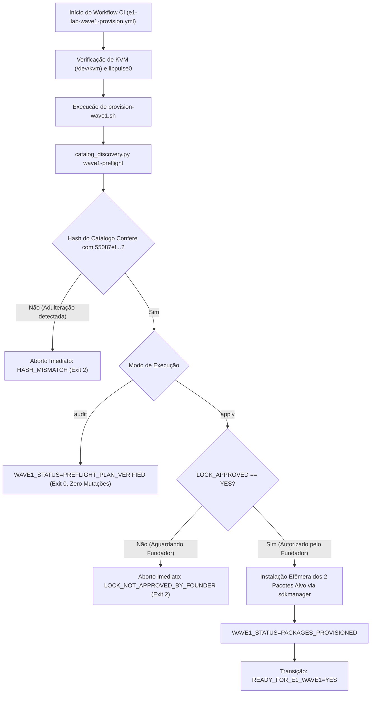

# WAVE 1 EXECUTION READINESS REPORT & FOUNDER DECISION BRIEFING

**Document Version:** 1.0  
**Date (UTC):** 2026-09-21T00:00:00Z  
**Lane:** G1 — RELIABILITY / ANDROID LAB  
**Status:** `READY_FOR_FOUNDER_DECISION`  
**Current Gate:** `G1_RELIABILITY_ANDROID_LAB`  
**Blocker Status:** `CATALOG_LOCK_PROPOSAL_FORMALIZED_AWAITING_FOUNDER_APPROVAL`  
**Starting Canonical Main:** `43018b1f9b14cb9e580d2157e6cb623ee18de0d1` (Strictly untouched)  
**Autonomous Working Branch:** `fio/autonomy-g1`  

---

## 1. Sumário Executivo

Este documento constitui o relatório técnico e estratégico definitivo para subsidiar a **decisão do Fundador** quanto à aprovação formal da **Proposta de Lock Canônica R1** (`ALVORADA_CATALOG_LOCK_PROPOSAL_V1`) e a consequente autorização para execução da **Wave 1 de Provisionamento Efêmero no GitHub Actions**.

Até o presente momento, sob as diretrizes estritas da governança autônoma e da `PRODUCT-CONSTITUTION.md`:
1. **Nenhum pacote Android foi instalado sem autorização.**
2. **Nenhuma licença SDK foi aceita sem revisão.**
3. **Nenhum centavo de infraestrutura paga foi consumido** (utilizados exclusivamente minutos inclusos de runner padrão `ubuntu-24.04`).
4. **A branch `main` remota permanece 100% intocada** em `43018b1f9b14cb9e580d2157e6cb623ee18de0d1`.
5. **Todas as 6 invariantes negativas do laboratório foram rigorosamente mantidas.**

A infraestrutura de provisionamento da Wave 1 encontra-se **completamente implementada, testada e verificada em CI remoto em modo de auditoria** (Run `35544892104`, exit code 0). O sistema está em estado fail-closed (`LOCK_APPROVED=NO`), aguardando exclusivamente a aprovação humana explícita para autorizar mutações de pacote.

---

## 2. Linha do Tempo e Matriz Comparativa de Provas Remotas (CI Ledger)

Ao longo das missões `05R-C`, `05R-D`, `05R-E`, `05R-F` e das iterações autônomas `AUTO-MISSION-001` a `008`, o laboratório acumulou um corpo empírico unificado de 6 execuções no ambiente oficial `ubuntu-24.04`:

| Run ID | Commit SHA | Workflow / Probe | Evidência Indexada | Resultado Empírico | Significado Arquitetural |
| :--- | :--- | :--- | :--- | :--- | :--- |
| **34868790788** | `2d8dddf0` | `e1-lab-discovery.yml` | `EVID-G1-0015` | `LAB_DISCOVERY_CONDITIONAL` (exit 2) | Mapeamento inicial: `/dev/kvm` presente sem permissão; ferramentas fora do PATH. |
| **34885736303** | `9177b8f4` | `e1-lab-remediation.yml` | `EVID-G1-0016` | `SDK_TOOLING_NOT_FOUND` (exit 0) | Remediação KVM via `setfacl` comprovada (R/W concedido); `sdkmanager` localizado. |
| **35528574530** | `43018b1f` | `e1-lab-emulator-provision.yml` | Autópsia Canônica | Exit 127 em `emulator -version` | Descoberta da dependência dinâmica ausente: `libpulse.so.0` no Ubuntu 24.04. |
| **35530880922** | `5277ff21` | `e1-lab-emulator-provision.yml` | `AUTO-MISSION-002` | `EMULATOR_PROVISION_PASS` (exit 0) | Resolução comprovada: `libpulse0` restaura `emulator -version` (37.1.11) e `EMULATOR_ACCEL_CHECK=PASS`. |
| **35540374123** | `059bd29b` | `e1-lab-catalog-discovery.yml` | `EVID-G1-0017` | `CATALOG_DISCOVERY_PASS` (exit 0) | Consulta upstream estritamente somente-leitura; catálogo auditado e selado sob hash `55087ef...`. |
| **35544892104** | `e98d0720` | `e1-lab-wave1-provision.yml` | `EVID-G1-0018` | `PREFLIGHT_PLAN_VERIFIED` (exit 0) | Workflow da Wave 1 auditado em CI em 13s; fail-closed verificado; zero mutações efetuadas. |

---

## 3. Auditoria Detalhada dos 5 Pacotes HARD_LOCK

O discovery remoto (Run `35540374123`) e o pré-voo criptográfico confirmaram a seguinte projeção exata do canal estável (`channel=0`):

```
                                      CATÁLOGO OFICIAL UPSTREAM (GOOGLE)
                                                      │
                       ┌──────────────────────────────┴──────────────────────────────┐
                       ▼                                                             ▼
         3 PACOTES PRÉ-INSTALADOS NO RUNNER                             2 PACOTES AUSENTES NO RUNNER
        (Verificados idênticos ao canal upstream)                     (Alvos de provisionamento efêmero)
                       │                                                             │
         • build-tools;36.0.0 (rev 36.0.0)                             • emulator (rev 37.1.11)
         • platform-tools (rev 37.0.1)                                 • system-images;android-36;default;x86_64 (rev 2)
         • platforms;android-36 (rev 2)                                              │
                       │                                                             ▼
                       ▼                                               VOLUME DE DOWNLOAD: ~1.55 GiB
         AÇÃO WAVE 1: NENHUMA (Preservados)                            TEMPO ESTIMADO EM CI: ~3-4 minutos
```

### Métricas de Eficiência e Economia:
- **60% dos pacotes já existem no runner:** Evitou-se o download redundante de `platforms;android-36` (~1.2 GB), `build-tools` (~100 MB) e `platform-tools` (~40 MB).
- **Alvos Específicos da Wave 1:**
  1. `emulator` (revisão `37.1.11`, canal 0 estável) — download ~150 MB.
  2. `system-images;android-36;default;x86_64` (revisão `2`, canal 0 estável) — download ~1.4 GB.
- **Impacto de Banda e Tempo:** O tempo estimado da Wave 1 em rede de 10 Gbps do GitHub é de aproximadamente **3 a 4 minutos**, mantendo o consumo bem abaixo dos limites de cotas gratuitas.

---

## 4. Garantias Criptográficas e Segurança Fail-Closed

A Wave 1 opera sob uma arquitetura de defesa em profundidade:



### Regras Criptográficas Rígidas:
1. **Identificador Canônico da Proposta:** `55087ef875573c7204251cd22ddd5fa92dd35b98321d95bcf41e60bddcc50d9f`.
2. **Imutabilidade da Descoberta:** O digest `55087ef...` protege a integridade exata dos pacotes e revisões coletadas no Run `35540374123`. Se qualquer terceiro tentar alterar a versão do emulador ou da imagem de sistema, o preflight falhará de forma fechada com `HASH_MISMATCH`.
3. **Barreira de Aprovação Humana:** O preflight exige explicitamente `lock_approved: "YES"` em modo `--apply`. Na ausência desta bandeira, nenhuma mutação é permitida.

---

## 5. Estado Atual das Invariantes Negativas

As seguintes invariantes contratuais continuam **100% verificadas e mantidas**:

- `API36 = NOT_PROVISIONED` (Nenhum pacote API 36 foi instalado na imagem base)
- `SYSTEM_IMAGE = NOT_PROVISIONED` (Nenhuma imagem de sistema foi instalada)
- `AVD = NOT_CREATED` (Nenhum dispositivo virtual foi criado)
- `P1_P10 = UNKNOWN` (Nenhuma alegação de confiabilidade musical foi feita)
- `READY_FOR_E1_WAVE1 = NO` (Aguardando execução da Wave 1)
- `LOCK_APPROVED = NO` (Aguardando decisão do Fundador)
- `origin/main = 43018b1f9b14cb9e580d2157e6cb623ee18de0d1` (Zero pushes para main)
- **Custo Financeiro Total:** USD 0.00.

---

## 6. Procedimento de Decisão e Aprovação do Fundador

Para autorizar a execução da Wave 1 e o provisionamento dos 2 pacotes aprovados, o Fundador dispõe de duas alternativas seguras e equivalentes:

### Opção A: Aprovação Automatizada via CLI (Recomendado)
No terminal da raiz do repositório (`C:\Users\phped\Documents\ALVORADA-sanitize`), execute o comando canônico:

```bash
python experiments/reliability-harness/scripts/catalog_discovery.py approve-lock --proposal evidence/g1/raw-mission05r/canonical_catalog_proposal.json
```

*Este comando valida o contrato, altera `"lock_approved": "YES"`, preserva o hash imutável de descoberta `55087ef...`, e re-emite o JSON canonicalizado.*

### Opção B: Edição Manual do Arquivo Canônico
No arquivo [`evidence/g1/raw-mission05r/canonical_catalog_proposal.json`](file:///C:/Users/phped/Documents/ALVORADA-sanitize/evidence/g1/raw-mission05r/canonical_catalog_proposal.json), altere:
```json
"lock_approved": "NO"
```
para:
```json
"lock_approved": "YES"
```

---

## 7. Próximos Passos Pós-Aprovação

Uma vez aprovado o lock pelo Fundador:
1. O commit de aprovação será registrado na branch de isolamento `fio/autonomy-g1`.
2. A Wave 1 será executada em modo `apply` (`.github/workflows/e1-lab-wave1-provision.yml`), realizando o provisionamento efêmero de `emulator 37.1.11` e `system-images;android-36;default;x86_64 rev 2`.
3. Ao concluir com sucesso, a invariante passará para `READY_FOR_E1_WAVE1=YES`.
4. O caminho estará formalmente desbloqueado para o design da **Wave 2** (criação e inicialização do AVD canônico `alvorada_e1_api36_x86_64`).
